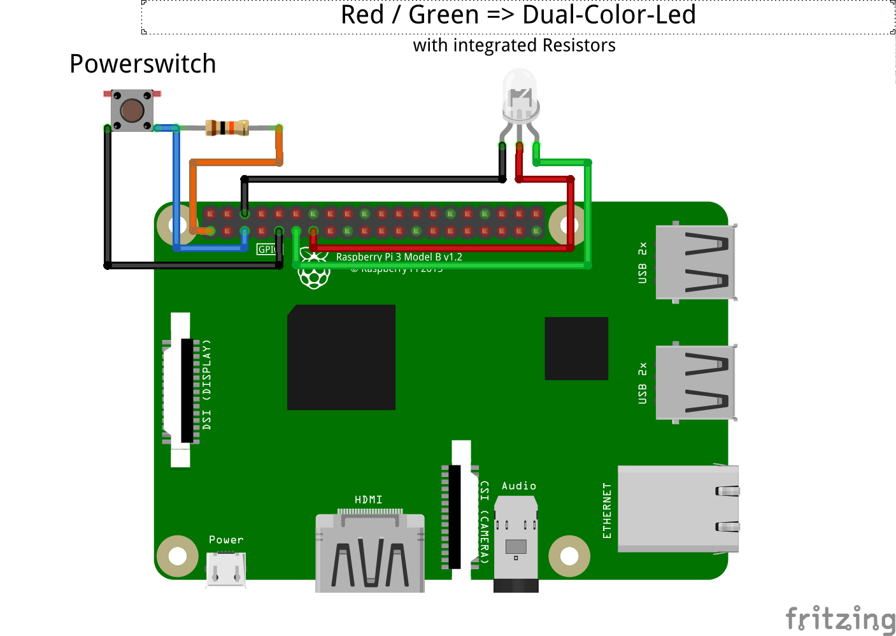

#    FabscanPI-Extender Script

**Just use _./install_ to install the Extender. Have fun.... ;)**

| LED (is on) | is flashing? | Description |
|---|---|---|
| green         |   short to no | RPi started & fabscan-extender is running.                      |
| green         |   short       | fabscanpi-server is running after bootup.                       |
| green         |   no          | ON-State Indicator                                              |
|               |               |                                                                 |
| red & green   |   yes         | Shutdown/Restart by pressing a Switch.                          |
|               |               |                                                                 |
| red           |   yes         | NO Network-Connection! networking-service is restarting.        |
| red           |   short       | fabscanpi-server is not running! -> Starting.                   |
|               |               |                                                                 |
| orange        |   short       | Only Lan-Connection, but no Internet.                           |
| orange        |   no          | When script is canceled by 'CTRL + C' (respectively 'STRG + C') |

To get the orange color you need a red/green dual-color led.  
If you use 1 red led and 1 green led, you get red led and green led turned on.  
If you use a led with other colors, the colors change to those that match your led.

Feel free to change as you like.... ;)

|**Log_output:**|                      |
|---------------|----------------------|
| 0             | disabled[_default_]    |
| 1             | only console         |
| 2             | only logfile         |
| 3             | to console & logfile |

set to 1 or 2 > a Logfile will be created => /var/log/fabscanpi/fabscanpi-extender.log  
pressing the shutdown-button deletes th Logfile 

Source (Fritzing): [./schematic/Switch-LED.fzz](./schematic/Switch-LED.fzz)

